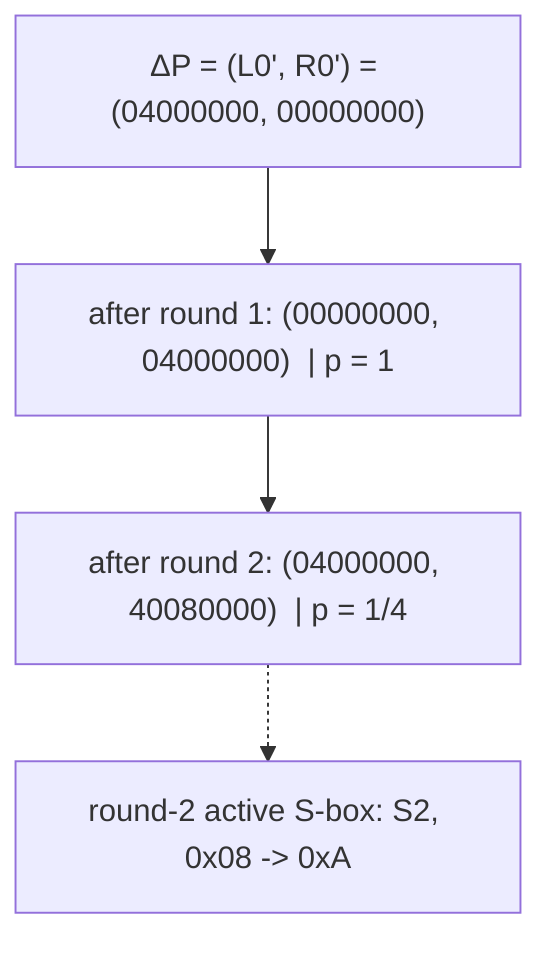

# Differential Trail used to break 4-Round DES

This document describes the exact differential characteristic used by
`cryptanalysis.ipynb` to recover the last-round subkey `K4` (and from it the
full key) of the 4-round DES variant (standard FIPS-46 S-boxes, standard
`E`, `P`, `PC-1`, `PC-2`, shift schedule `[1,1,2,2]`, no `IP`/`IP^-1`).

## Notation

Each round is

```
L_i = R_{i-1}
R_i = L_{i-1} XOR F(R_{i-1}, K_i)
```

and the 64-bit ciphertext (with the standard pre-output swap) is `C = (R4 || L4)`.
A prime denotes the XOR difference of a chosen-plaintext pair, e.g.
`R2' = R2 XOR R2*`. All 32-bit values are written as 8 hex digits, MSB first
(bit 1 = most significant).

## 1. The S-box differential at the heart of the trail

Searching the difference distribution tables (DDTs) over all 6-bit input
differences whose two **outer** bits are zero (so the expansion `E` activates a
single S-box without disturbing its neighbours), the best entry is in **S2**:

| Property | Value |
|---|---|
| Active S-box | **S2** |
| Input difference `Δin` | `0x08` = `001000`b |
| Output difference `Δout` | `0xA` = `1010`b |
| DDT count | **16 / 64** |
| Probability `p` | **16/64 = 1/4** |

With the S-box addressing `row = (b1 b6)`, `col = (b2 b3 b4 b5)`, the input
difference `0x08` sets only `b3` (a column bit); the outer bits `b1, b6` are 0.

## 2. Realising the differential: choosing the plaintext difference

We use chosen-plaintext pairs that differ **only in the left half**:

```
ΔP = (L0', R0') = (0x04000000, 0x00000000)
```

`L0' = 0x04000000` sets exactly **input bit 6** of the right half. Under the
expansion `E`, bit 6 lands only in S2's 6-bit group (E-group S2 covers input
bits 4,5,6,7,8,9), at the third position of that sextet:

```
E(0x04000000) per S-box group (S1 .. S8):
  S1: 000000   S2: 001000 (=0x08)   S3: 000000   S4: 000000
  S5: 000000   S6: 000000           S7: 000000   S8: 000000
```

So the round-2 S-box input difference is `0x08` in S2 and `0` everywhere else,
exactly the differential of Section 1.

## 3. The round-by-round characteristic (rounds 1 -> 2)

Because the right halves are identical (`R0' = 0`), round 1 passes its
difference through `F` for free, and round 2 applies the S2 differential:

| After round | `ΔL` | `ΔR` | Round probability |
|---|---|---|---|
| input (`ΔP`) | `0x04000000` | `0x00000000` | - |
| round 1 | `0x00000000` | `0x04000000` | `1` (since `ΔR0 = 0` => `ΔF = 0`) |
| round 2 | `0x04000000` | `0x40080000` | `1/4` (S2: `0x08 -> 0xA`) |

The round-2 output difference of `F` is the S2 output difference `0xA` placed in
S2's output nibble, i.e. `0x0A000000`, permuted by `P`:

```
P(0x0A000000) = 0x40080000
```

(Concretely, the two set bits of `0x0A000000` are pre-`P` positions 5 and 7,
which `P` sends to output positions 13 and 2, giving `0x40080000`.)

Hence, for a **right pair**, the difference after two rounds is the constant

```
ΔL2 = 0x04000000      ΔR2 = c = 0x40080000     (probability 1/4)
```

### Trail diagram



## 4. How the trail drives the last-round key recovery

The characteristic only needs to fix `ΔR2`. The fourth round gives
`R4 = L3 XOR F(R3, K4)` with `L3 = R2`, therefore

```
F(R3, K4) XOR F(R3*, K4) = R4' XOR R2' = R4' XOR c        (for right pairs)
```

Both quantities on the right are available from the ciphertext:

- `R3 = L4` is read directly from `C = (R4 || L4)` (so round 3 needs **no**
  characteristic - its actual difference is observed, not predicted);
- `R4'` is the difference of the left halves of the two ciphertexts.

For each S-box `m` and each 6-bit candidate `k`, we count pairs satisfying

```
S_m(a_m XOR k) XOR S_m(b_m XOR k) = Δout_m
```

where `a_m, b_m` are the actual S-box inputs `E(R3)_m, E(R3*)_m` and `Δout_m`
comes from `P^-1(R4' XOR c)`. The correct `K4` chunk is reinforced by the right
pairs; the most-voted candidate per S-box is the recovered chunk.

## 5. Why this trail is efficient

The round-2 characteristic has a **single** active S-box, so the prediction
error `P^-1(R2' XOR c)` is non-zero only in S2's output nibble. As a result the
predicted round-4 output difference is correct for **every** pair for the seven
S-boxes other than S2 - those 42 `K4` bits are recovered deterministically - and
only S2 depends on the probability `p = 1/4`. About `1/4` of the pairs in which
S2 is active are right pairs, which is enough to separate the true 6-bit value
from all 63 wrong candidates.

## 6. Result of the live run (400 pairs, 800 counting queries)

Per-S-box recovery against the deployed oracle:

| S-box | S1 | S2 | S3 | S4 | S5 | S6 | S7 | S8 |
|---|---|---|---|---|---|---|---|---|
| votes / active | 333/333 | 62/342 | 369/369 | 378/378 | 371/371 | 388/388 | 358/358 | 363/363 |
| `K4` chunk | `0x22` | `0x16` | `0x39` | `0x21` | `0x26` | `0x3A` | `0x1F` | `0x23` |

- Recovered last-round subkey: `K4 = 0x896E619BA7E3`
- Recovered full key (after inverting the schedule + 8-bit brute force):
  `0x8B2F88A663CB4D`
- Verified on 20 fresh plaintexts: **PASS**
- Total oracle queries: **822** (1 probe + 800 counting + 1 known pair + 20 verification), within the 1000/day limit.
